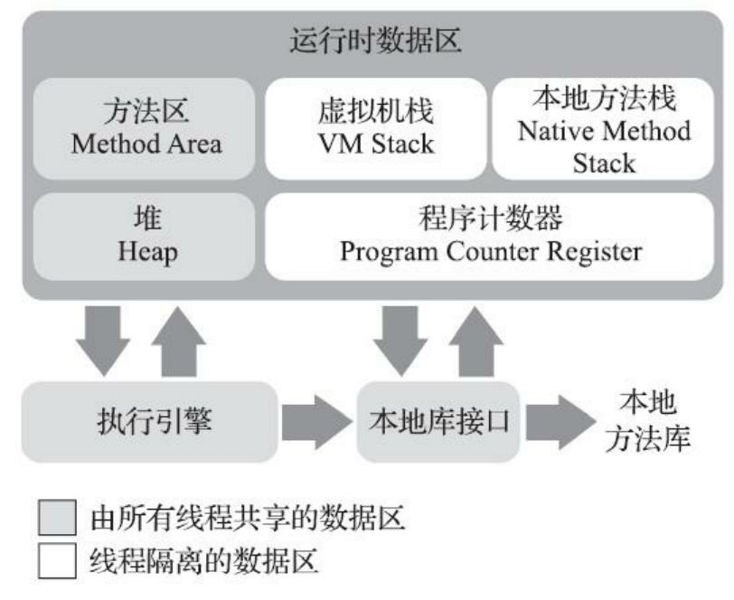
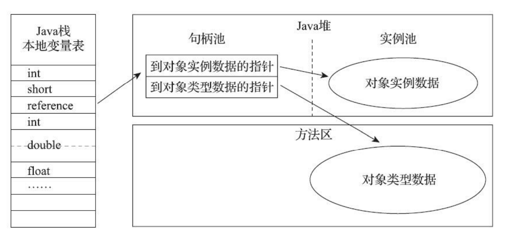

# 宋红康老师的JVM 视频教程笔记

java 的跨平台性，一次编译到处运行。

java 不是最强大的语言，java虚拟机是更强大的语言

java 虚拟机可以运行各种语言编译好的，字节码文件。字节码文件只要符合java 虚拟机的规范即可。


# 字节码

字节码与多语言混合编程。其他语言通过自己的编译器编译成jvm字节码。就可以被 Java 虚拟机运行。

三大难题

CPU

操作系统

编译器

# 虚拟机

虚拟机分为系统虚拟机和程序虚拟机。

VMWare 就是系统虚拟机。

# Java 虚拟机

一台执行Java 字节码的虚拟计算机，

就是二进制字节码的运行环境。

Java 技术的核心就是Java 虚拟机。


JVM 特点

一次编译到处运行

自动管理内存

自动垃圾回收功能

# Java 代码的执行流程

Java 程序编译成。class 字节码，

# Java 的架构模型

基于栈式架构

基于寄存器架构

# JVM 的生命周期

JVM 虚拟机通过引导类加载器（BootStrap class loader） 创建一个初始类（inital class） 来完成的，这个类是由虚拟机的具体实现指定的。

虚拟机的执行

一个运行的Java  虚拟机由着一个清晰的任务，执行Java 程序。

程序开始执行他才运行，程序结束它就停止。

执行一个所谓的Java 程序的时候，真真正正在执行的是 一个叫做Java 虚拟机的进程。

JVM 的退出

* 程序正常执行结束
* 程序执行过程中遇到异常或者错误而异常终止
* 由于操作系统出现错误而导致JVM 虚拟机进程终止
* 某线程调用Runtime 类或者System类的 exit() 方法，或者Runtime 类的 halt（）方法，并且Java 线程安全管理器也允许这次exit或halt操作。
* 除此之外，JNI（Java Native Interface ）规范描述了用JNI  Invacation API 来加载或者卸载 Java 虚拟机时，Java 虚拟机的退出情况。

# JVM 发展历程


**Sun classic VM** :

​		世界上第一款商用Java 虚拟机，只提供了解释器。 JDK 1.4 已经被淘汰。内部只提供了解释器。如果使用编译器（JIT）就要使用外挂。但是 解释器的不能在工作了，只能二选一工作。

**Exact VM** 

* Exact Memory Management : 准确式内存管理

虚拟机可以准确的知道内存中某个位置数据提供是什么类型

* 具备现代高性能虚拟机的雏形
	* 热点探索
	* 编译器和解释器混合工作模式
* 只在Solaris 平台短暂使用，其他平台还是sun classic vm 
	* 英雄气短，最终被Hotspot 虚拟机替换。


**HotSpot 虚拟机**

* JDK 1.3  HotSpot VM 成为默认的虚拟机
* 目前占有绝对的市场。
* HosPot 指的就是热点代码探索技术
	* 通过计数器找到最具编译价值的代码，触发即时编译或栈上替换
	* 通过编译器与解释器（逐行解释）协同工作，在最有的程序响应时间与最佳执行性能中取得平衡。

EBA 的 **JRockit VM** 

* 专注于服务端应用
	* 不太关注程序的启动速度，JRockit 内部不包含解析器实现，全部代码靠即时编译器编译后执行。
	* JRockit JVM 是世界上最快 的 JVM
	* 2008 年EBA 被Oracle 收购。JDK 8 中把 两大虚拟机进行了整合。

IBM 的 J9

*  全称： IBM Technology for Java Virtual Machine，简称 IT4J ,内部代号: J9
*  市场定位和 HotSopt 接近，服务器端、桌面应用、嵌入式等多用途VM.
*  目前有影响力的三大商用虚拟机之一，也号称世界最快的Java 虚拟机。
*  2017 年，IBM 发布了开源 J9 VM ,命名 OpenJ9，交给Eclispe 基金会管理。

KVM 和 CDC/GLDC Hotspot

* KVM 是 CLDC-HI 早期产品。

* KVM 简单、轻量、高度可移植，面向更低端的设备上还维持着知己的一片市场。

	* 智能控制器、传感器
	* 老人机、经济欠发达地区的功能手机

	所有虚拟机的原则，一次编译，到处运行。

**Azul VM**

 * 与特定硬件平台绑定，软硬件配合的专有虚拟机
	* 高性能Java 虚拟机中的战斗机。
* Azul VM 是 Azul Systems 公司在 HotSpot 基础上进行大量的改进，运行于Azul Systems 公司的专有硬件Vega 系统上的Java 虚拟机。
* 每个Azual VM 实例都可以管理至少数十个CPU和数百GB 内存硬件资源，并提供在巨大内存范围内实现可控的GC 时间的垃圾收集器、专有硬件优化的线程调度等优秀特性。
* 2010 年，公司开始硬件转向软件，发布了自己的Zing JVM

可以在通用x86 平台提供接近于Vega 系统的特性。

**Liquid VM** 

* 高性能Java 虚拟机中的战斗机

* BEA 公司开发的，直接运行在自己 Hypervisor 系统上

* Liquid VM  即是现在 的 JRockit VE (Virtual Edition)

	Liquid VM 不需要操作系统的支持，本身实现了一个专有系统的必要功能，如线程调度、文件系统、网络支持等。

* 随着 JRockit 虚拟机的终止时开发，Liquid VM 项目也停止了。

**Apcahe Harmony**

* Apache 也曾推出过与JDK 1.5 和 JDK 1.6 兼容的Java 运行平台 Apache harmony.
* 它是IBM 和 Intel 联合开发的开源JVM。未能获得JCP 认证，2011年退役。
* 没有大规模商用案例，代码类库被吸纳进了Android SDK.

 Microsoft JVM

* 微软公司为了在IE3 浏览器中支持Java Applets ,开发了Microsoft VM。
* 只能在 window平台下运行，是当时window 下性能最好的Java VM。
* 1997 年，Sun 以侵犯商标指控微软，赔了好多钱。微软在windowSP SP3 中抹掉了其VM 。现在windows 上安装的都是HotSpot.

**TaoBao VM** 

* 国内阿里使用的JVM , 基于Open JDK 开发的定制版本Alibaba JDK ,简称AJDK,

* 深度定制且开源的高性能服务器
* 创新GCIH 技术实现off-heap, 将生命周期较长的Java 对象从heap 已到heap 之外，并且GC 不能管理GC IH  内部的Java 对象。以此达到降低GC 的回收频率和提升GC 的回收效率的目的。
* GCIH 中的对象还能搞在多个Java 虚拟机集成中实现共享。
* 目前 淘宝天猫上线，把Oracle 官方的JVM 版本全部替换了。

**DAlivk VM** 

* 谷歌开发，应用于安卓系统。只能称为虚拟机。
* 安卓5.0 ART VM 使用支持提前编译（Ahead of Time Complatioin）替换 Dalivk VM。

**具体 JVM 的内存结构，其实取决于其实现，不同厂商的JVM，或者同一厂商发布不同版本的**

**Graal VM** 

跨语言的全全栈虚拟机，可以作为任何语言的运行平台使用。

如果说HotSpot 有一天真的被取代 Graal VM 希望最大。

但是 Java 软件的软件生态没有丝毫变化。

# 

#  Java 编程语言

Java 是一种高级语言，高级语言编写容易，可移植。低级语言编写的程序智能在一种机器上运行。

有两种将高级语言转换为低级语言的程序：解释器和编译器。

解释器： 每次处理高级语言的一小部分程序，交替执行代码并计算。


```mermaid
graph LR
源代码 --> 解释器 --> 输出
```

编译器：读取并转换整个程序，然后才开始运行程序。程序编译后可以反复执行，不需要每次执行前都进行转换。


Java 语言 即是编译型，又是解释型。Java 编译器不将程序直接转换为机器语言，而是生成字节码（byte code)。

字节码类似于机器语言。解释起来轻松快捷。同时可以移植。运行字节码的解释器被称为Java 虚拟机。

```mermaid
graph LR
源代码hello.java--> 编译器 --> 字节码hello.calss --> 解释器JVM --> 输出

```

# 内存结构概述


# 类Java加载器

类加载器子系统的作用

* 类加载器子系统负责从文件系统或者网络中加载Class 文件，class 文件在文件中开头有特定的文件标识。

* Class Loader 只负责class文件的加载，至于它是否可以运行。则由 Execution Engine 决定。
* 加载的类信息存放与一块称为方法区的内存空间，除了类的信息外，方法区还会存放运行时常量池信息，可能还包括字符串字面量，和数字常量（这部分常量信息是Class文件中常量吃部分的内存映射）。

# 类的加载过程

1. ## 加载loading

	1. 通过一个类的全限定名获取类的二进制字节流。
	2. 将字节流所代表的静态存储结构转化为方法区的运行时数据。
	3. 在内存中生成一个代表着个类的对象，作为方法区这个类的各种数据的访问入口

加载 class 文件的方式

* 从本地系统直接加载
* 通过网络进行获取
* 从zip 压缩包获取
* 运行时计算生成，最多使用的动态代理技术
* 由其他文件生成JSP
* 从专有的数据中提取.class 文件获取，比较少见
* 从加密文件中获取，典型的防Class 文件被反编译的加密措施。

2. #### **链接linking**

	1. **验证 (verify)**

		* 确保class文件的字节流中包含的信息符合当前虚拟机的要求，保证类的正确性
		* 包括四种验证：文件格式验证、元数据验证、字节码验证、符号引用验证

	2. **准备（Prepare)**

		补充知识：

		类变量也叫静态变量，就是变量前加了static

		实例变量也叫对象变量，即没加static 的变量。

		类变量时所有对象共有的，其中一个对象改变他的值，起的对象得到的就是他改变后的结果。

		实例变量对象私有，值的改变，不影响其他对象。

		* 为类的变量分配内存并且设置该类变量的默认初始值。 即0值
		* 这里不包含final 修饰的static ，因为final在编译的时候集中分配了，准备阶段会显式初始化。
		* 这里不会为实例变量初始化，类变量会分配在方法区中。实例变量会随着对象一起分配到Java 堆中。

	3. 解析（Resolve）

		* 将常量池的符号引用转换为直接引用的过程。
		* 事实上，解析操作往往会伴随着JVM 执行完初始化之后再执行
		* 符号引用：就是一组用来描述所引用的目标，符号引用的字面量形式明确定义在《Java 虚拟机规范》的Class 文件格式中。
		* 直接应用：就是直接指向目标的指针，相对偏移量或一个间接定位的句柄。
		* 解析动作主要针对类或接口、字段、类方法、接口方法、方法类型对应常量池中的 CONSTANT_Class_info、CONSTANT_Fieldref_info、CONSTANT_Methodref_info。

3. **初始化阶段**

	* 初始化阶段就是执行类构造器方法<clinit>()的过程

	* 此方法不需要定义，Javac 编译器自动收集类中所有类变量的赋值动作和静态代码块中的语句合并而来。
	* 构造器方法中智能按语句在源文件中出现的顺序执行
	* <clinit>() 不同于类的构造器。（关联：构造器是虚拟机视角下的<init>()
	* 若该类具有父类，JVM 会保证子类的父类的<clint>()在子类前执行。
	* 虚拟机必须保证一个类的<clinit>()方法在多线程下被同步加锁。

	

# P31

### 类加载器

类加载器分为引导类加载器和自定义加载器。

```mermaid
 classDiagram
     BootStrapClassLoader <|-- SecureClassLoader:  继承
     SecureClassLoader <|-- URLClassLoader:继承
     URLClassLoader <|-- ExClassLoader:继承
      URLClassLoader <|-- AppClassLoader:继承
     
    class BootStrapClassLoader{
          beakColor(String)
         resolveClass(Class<?>)
          findClass(String)
          defineClass(byte[],int,int)
      }
    
      class SecureClassLoader{
         
      }
      class URLClassLoader{
      	findClass(String)
      }
     class ExClassLoader{
     
     }
     class AppClassLoader{
     	loadClass(String,boolean)
     }
```

1. Bootstarop ClassLoader 启动类加载器
	* 非Java 语言编写。C 和 C++
	* 加载Java 核心类库，（java_home/jre/lib/rt.jar、resources.jar 或sun.boot.class.path路径下的内容），用于提供JVM自身需要的类。
	* 并不继承java.lang.ClassLoader, 没有父加载器。
	* 加载扩展类和应用程序类加载器，并在指定为他们的父类加载器。
	* 出于安全考虑，Boostrap 启动类加载器，只加载包名为java 、javax 、sun等开头的类


2. Extension ClassLoader 扩展类加载器。

	* java 语言编写，间接继承启动类加载器。
	* 加载jre/lib/ext 子目录文件下加载类库

	​	

3. AppClassLoader 应用程序类加载器。

	* java 语言编写。

	* 父类加载器扩展类加载器
	* 加载 classpath 或者 系统属性java.class.path 指定路径下的类库。
	* 通过ClassLoader.getSystemClassLoader 获取类加载器。

获取类的类加载器使用 

```java
 ClassLoader classLoader = String.class.getClassLoader();
        System.out.println(classLoader);
```

### 自定类的加载器

#### 原因：

隔离加载类

修改加载类的方式

扩展加载源

防止源码泄漏

#### 获取类加载器的方式

| 获取当前类的ClassLoader         |              clazz.getClassLoader              |
| :------------------------------ | :--------------------------------------------: |
| 获取当前线程上下文的ClassLoader | Thread.currentThread().getContextClassLoader() |
| 获取系统的类加载器              |          ClassLoader.getClassLoader()          |
| 获取调用者的类加载器            |      DriverManager.getCallerClassLoader()      |

### 双亲委派机制

java 虚拟机加载class 文件，采取按需加载，使用什么加载什么到虚拟机内存中生成class对象，java中采用双亲委派模式，即把请求交给父类处理，它是一种任务委派模式。

#### 双亲委派工作原理

1. 如果一个类加载器收到了类加载的请求，它并不会自己先去加载，而是把这个请求委托给父类的加载器去执行；
2. 如果父类加载器还存在父类加载器，则进一步向上委托，依次递归，请求最终到达顶层的启动类加载器。

3. 如果父类加载器可以完成类加载任务，就能成功返回，倘若父类加载器无法完成加载任务，子加载器才会尝试自己去加载，这就是双亲委派模式。

#### 反向委托

第三方的api  接口由启动类加载器加载，接口的具体实现由系统类加载器加载。


#### 双亲委派机制的优势


避免类的重复加载

保护程序安全，防止核心API 被随意篡改。


### 沙箱安全机制

自定义String ，但是在加载自定义String类时候会率先使用引导类加载器加载，而引导类加载器在加载过程中会率先加载jdk 自带的文件，也就是rt包下的String 类，这样可以保证对java核心源代码的保护。这就是沙箱安全机制。

在JVM 中表示两个class 对象是否是同一类存在的必要条件：

* 类的完整类名必须一致，包括包名
* 架子啊这个类的classLoader 必须相同。

也就是说，在JVM 中两个类的来源同一个Class文件，被同一个虚拟机所加载，只要加载他们的类加载器不是同一个，那么这两个类对象就是不对等的。

### Java 程序对类的使用方式，主动使用和被动使用。

#### 主动使用

- 创建类的实例
- 访问某个类或者接口的静态变量，或者对该静态变量赋值
- 调用类的静态方法
- 反射
- 初始化一个类的子类
- Java 虚拟机启动时被标明为启动类
- JDK 7 提供的动态语言支持Java.lang.invoke.MethodHandle 实例的解析结果REF_getStatic、REF_putStatic、REF_invokeStatic 句柄对应的类没有初始化，则初始化。

#### 被动使用

除了以上七种都是被动使用


# P39


Java  **进程**共享方法区和堆。

一个**线程**一个程序计数器，本地方法栈、虚拟机栈。

# 线程

线程一个程序的运行单元。Java 虚拟机允许一个应用有多个线程并行执行。

在Hotspot JVM  里 ，每一个线程都与操作系统的本地线程直接映射。

当一个Java 线程准备好执行以后，此时一个操作系统的本地线程也同时创建，Java 线程执行终止胡，本地线程也会回收。

操作系统负责所有线程的暗票调度到任何一个可用的CPU 上，一旦本地线程初始化成功，它就会调用Java 线程的run() 方法。

JVM  中的线程：

* 虚拟机线程
* 周期任务线程
* GC 线程
* 编译线程

* 信号调度线程

# 运行时数据区



## 程序计数器

当前线程的所执行的字节码行号指示器。 一个线程，有一个程序计数器。

各个线程的程序计数器互不影响。

## Java 虚拟机栈（Java Virtual Machine Stack）

与程序计数器一样，Java虚拟机栈（Java Virtual Machine Stack）也是线程私有的，它的生命周期 与线程相同。虚拟机栈描述的是Java方法执行的线程内存模型：每个方法被执行的时候，Java虚拟机都 会同步创建一个栈帧[1]（Stack Frame）用于存储局部变量表、操作数栈、动态连接、方法出口等信 息。每一个方法被调用直至执行完毕的过程，就对应着一个栈帧在虚拟机栈中从入栈到出栈的过程。

在《Java虚拟机规范》中，对这个内存区域规定了两类异常状况：如果线程请求的栈深度大于虚 拟机所允许的深度，将抛出StackOverflowError异常；如果Java虚拟机栈容量可以动态扩展[2]，当栈扩 展时无法申请到足够的内存会抛出OutOfMemoryError异常。

## 本地方法栈

本地方法栈（Native Method Stacks）与虚拟机栈所发挥的作用是非常相似的，其区别只是虚拟机 栈为虚拟机执行Java方法（也就是字节码）服务，而本地方法栈则是为虚拟机使用到的本地（Native） 方法服务。 《Java虚拟机规范》对本地方法栈中方法使用的语言、使用方式与数据结构并没有任何强制规 定，因此具体的虚拟机可以根据需要自由实现它，甚至有的Java虚拟机（譬如Hot-Spot虚拟机）直接 就把本地方法栈和虚拟机栈合二为一。与虚拟机栈一样，本地方法栈也会在栈深度溢出或者栈扩展失 败时分别抛出StackOverflowError和OutOfMemoryError异常。

## java 堆

​		对于Java应用程序来说，Java堆（Java Heap）是虚拟机所管理的内存中最大的一块。Java堆是被所 有线程共享的一块内存区域，在虚拟机启动时创建。此内存区域的唯一目的就是存放对象实例，Java 世界里“几乎”所有的对象实例都在这里分配内存。

Java堆既可以被实现成固定大小的，也可以是可扩展的，不过当前主流的Java虚拟机都是按照可扩 展来实现的（通过参数-Xmx和-Xms设定）。如果在Java堆中没有内存完成实例分配，并且堆也无法再 扩展时，Java虚拟机将会抛出OutOfMemoryError异常。

## 方法区

方法区（Method Area）与Java堆一样，是各个线程共享的内存区域，它用于存储已被虚拟机加载 的类型信息、常量、静态变量、即时编译器编译后的代码缓存等数据。虽然《Java虚拟机规范》中把 方法区描述为堆的一个逻辑部分，但是它却有一个别名叫作“非堆”（Non-Heap），目的是与Java堆区 分开来。

* 运行时常量池（Runtime Constant pool）

	​		Class文件中除了有类的版本、字 段、方法、接口等描述信息外，还有一项信息是常量池表（Constant Pool Table），用于存放编译期生 成的各种字面量与符号引用，这部分内容将在类加载后存放到方法区的运行时常量池中。

	​		运行时常量池相对于Class文件常量池的另外一个重要特征是具备动态性，Java语言并不要求常量 一定只有编译期才能产生，也就是说，并非预置入Class文件中常量池的内容才能进入方法区运行时常 量池，运行期间也可以将新的常量放入池中，这种特性被开发人员利用得比较多的便是String类的 intern()方法。 既然运行时常量池是方法区的一部分，自然受到方法区内存的限制，当常量池无法再申请到内存 时会抛出OutOfMemoryError异常。

## 直接内存

​		直接内存（Direct Memory）并不是虚拟机运行时数据区的一部分，也不是《Java虚拟机规范》中 定义的内存区域。但是这部分内存也被频繁地使用，而且也可能导致OutOfMemoryError异常出现，所 以我们放到这里一起讲解。

​		 在JDK 1.4中新加入了NIO（New Input/Output）类，引入了一种基于通道（Channel）与缓冲区 （Buffer）的I/O方式，它可以使用Native函数库直接分配堆外内存，然后通过一个存储在Java堆里面的 DirectByteBuffer对象作为这块内存的引用进行操作。这样能在一些场景中显著提高性能，因为避免了 在Java堆和Native堆中来回复制数据。 

​		显然，本机直接内存的分配不会受到Java堆大小的限制，但是，既然是内存，则肯定还是会受到 本机总内存（包括物理内存、SWAP分区或者分页文件）大小以及处理器寻址空间的限制，一般服务 器管理员配置虚拟机参数时，会根据实际内存去设置-Xmx等参数信息，但经常忽略掉直接内存，使得 各个内存区域总和大于物理内存限制（包括物理的和操作系统级的限制），从而导致动态扩展时出现 OutOfMemoryError异常

## 对象的创建

​	在语言层面 上，创建对象通常（例外：复制、反序列化）仅仅是一个new关键字而已。

**普通java 对象的创建：**

​		当Java虚拟机遇到一条字节码new指令时，首先将去检查这个指令的参数是否能在常量池中定位到 一个类的符号引用，并且检查这个符号引用代表的类是否已被加载、解析和初始化过。如果没有，那 必须先执行相应的类加载过程。

​		在类加载检查通过后，接下来虚拟机将为新生对象分配内存。对象所需内存的大小在类加载完成 后便可完全确定。

​		内存分配完成之后，虚拟机必须将分配到的内存空间（但不包括对象头）都初始化为零值，如果 使用了TLAB的话，这一项工作也可以提前至TLAB分配时顺便进行。这步操作保证了对象的实例字段 在Java代码中可以不赋初始值就直接使用，使程序能访问到这些字段的数据类型所对应的零值。

​		Java虚拟机还要对对象进行必要的设置，例如这个对象是哪个类的实例、如何才能找到 类的元数据信息、对象的哈希码（实际上对象的哈希码会延后到真正调用Object::hashCode()方法时才 计算）、对象的GC分代年龄等信息。这些信息存放在对象的对象头（Object Header）之中。根据虚拟 机当前运行状态的不同，如是否启用偏向锁等，对象头会有不同的设置方式。

​		在上面工作都完成之后，从虚拟机的视角来看，一个新的对象已经产生了。但是从Java程序的视 角看来，对象创建才刚刚开始——构造函数，即Class文件中的()方法还没有执行，所有的字段都 为默认的零值，对象需要的其他资源和状态信息也还没有按照预定的意图构造好。一般来说（由字节 码流中new指令后面是否跟随invokespecial指令所决定，Java编译器会在遇到new关键字的地方同时生成 这两条字节码指令，但如果直接通过其他方式产生的则不一定如此），new指令之后会接着执行 ()方法，按照程序员的意愿对对象进行初始化，这样一个真正可用的对象才算完全被构造出来。

## 对象的布局

* 对象头（Header）

	* 一部分用于存储自身运行时数据。第一类是用于存储对象自身的运行时数据，如哈 希码（HashCode）、GC分代年龄、锁状态标志、线程持有的锁、偏向线程ID、偏向时间戳等，这部 分数据的长度在32位和64位的虚拟机（未开启压缩指针）中分别为32个比特和64个比特。，官方称它 为“Mark Word”。

		

	* 一部分类型指针，对象指向他的类型元数据的指针。Java虚拟机通过这个指针 来确定该对象是哪个类的实例。

* 实例数据（Instance Data)

	是对象真正存储的有效信息，即我们在程序代码里面所定义的各种类型的字 段内容，无论是从父类继承下来的，还是在子类中定义的字段都必须记录起来。这部分的存储顺序会 受到虚拟机分配策略参数（-XX：FieldsAllocationStyle参数）和字段在Java源码中定义顺序的影响。 HotSpot虚拟机默认的分配顺序为longs/doubles、ints、shorts/chars、bytes/booleans、oops（Ordinary Object Pointers，OOPs），从以上默认的分配策略中可以看到，相同宽度的字段总是被分配到一起存 放，在满足这个前提条件的情况下，在父类中定义的变量会出现在子类之前。如果HotSpot虚拟机的 +XX：CompactFields参数值为true（默认就为true），那子类之中较窄的变量也允许插入父类变量的空 隙之中，以节省出一点点空间。

* 对齐填充(Padding)

	这并不是必然存在的，也没有特别的含义，它仅仅起着占位符的作 用。由于HotSpot虚拟机的自动内存管理系统要求对象起始地址必须是8字节的整数倍，换句话说就是 任何对象的大小都必须是8字节的整数倍。对象头部分已经被精心设计成正好是8字节的倍数（1倍或者 2倍），因此，如果对象实例数据部分没有对齐的话，就需要通过对齐填充来补全。

## 对象的访问定位

主流访问方式有句柄和直接指针

* 句柄访问，reference 存储句柄池地址，在java 堆内，指向实例池中对象的实例数据，同时指向方法区中对象的类型数据。如下图



* 直接访问, reference 存储java 堆中对象实例数据，同时实例数据中，存放指向方法区中对象数据类型的指针


```shell
-verbose:gc -Xms20M -Xmx20M -Xmn10m -XX:+PrintGCDetails -XX:SurvivorRatio=8
```

```java
public class HeapOOM {
    static class OOMObject{}

    public static void main(String[] args) {
        List<OOMObject> list = new ArrayList<>();
        while(true){
            list.add(new OOMObject());
        }
    }
}
```

设置JVM 参数运行山上述代码，测试OutOfMemoryError 错误


Exception in thread "main" java.lang.OutOfMemoryError: Java heap space


#  垃圾收集器和内存分配策略

