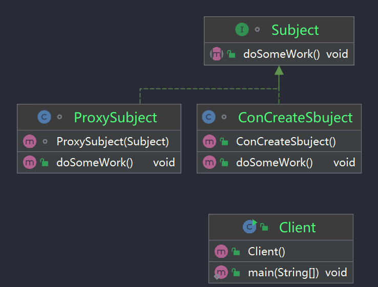

# 代理模式

## 介绍

代理模式（Proxy Pattern）一般是指一个对象为另一个对象提供一种代理，从而通过代理对象来控制非代理对象的访问，代理对象在客户端和目标对象之间起到中介作用。

代理模式属于结构型设计模式，可以分为静态代理和动态代理两种类型，而动态代理中又分为 JDK 动态代理和 CGLIB 代理两种。

## 1. 静态代理模式

标准的静态代理模式需要定义一个接口，然后代理对象与被代理对象都需要实现标准接口，并重写标准接口中定义的方法，被代理对象本身需要实现真正的业务逻辑，而代理对象中一般是在调用被代理对象的前后新增一些其它逻辑处理。


### UML



### 代码

### 标准接口

```java
//创建一个接口
interface Subject {
    void doSomeWork();
}

```

### 目标类

```java
//创建目标类
class ConCreateSbuject implements Subject{
    @Override
    public void doSomeWork() {
        System.out.println("目标类的dosomeWork() 方法被调用");
    }
}
```

### 代理类

```java
class ProxySubject implements Subject{
    Subject cs;
    ProxySubject(Subject cs) {
        this.cs = cs;
    }
    @Override
    public void doSomeWork() {
        //调用目标类的方法
        System.out.println("代理类执行前");
        cs.doSomeWork();
        System.out.println("代理类执行前");
    }
}
```

### 测试

```java
//测试代码
public class Client{
    public static void main(String[] args) {
        Subject cs = new ConCreateSbuject();
        ProxySubject proxySubject = new ProxySubject(cs);
        proxySubject.doSomeWork();
    }
}
```

###  静态代理缺点

1. 代理对象需要显示的声明被代理对象，如果说后面想要修改代理对象，则需要修改源代码，不符合开闭原则。
2. 被代理对象如果新增了其它方法（接口新增了方法），那么代理对象也需要同步修改，不便于后期维护。

所以为了解决静态代理的局限性，就有了动态代理。

## 2. 动态代理

### 2.1 JDK 动态代理

从名字可以猜到，这就是 JDK 内置的一种动态代理的实现方式，使用 JDK 动态代理必须满足以下两个条件：

1. 定义的代理对象必须要实现 `java.lang.reflect.InvocationHandler` 接口。
2. 被代理对象必须要显式的实现至少一个接口。

示例代码

主要依靠这3个类实现动态代理

import java.lang.reflect.InvocationHandler;
import java.lang.reflect.Method;
import java.lang.reflect.Proxy;

这里代理对象时根据目标类动态生成

### JDK 动态代理示例

#### 创建接口

```java
//创建一个接口
interface Subject {
    void doSomeWork();
}
```

#### 目标类

```java
class ConCreateSbuject implements Subject {
    @Override
    public void doSomeWork() {
        System.out.println("目标类的dosomeWork() 方法被调用");
    }
}
```

#### 代理工厂

```java
//创建代理工厂
public class ProxyFactory  {
    Subject targetObject;
    ProxyFactory(Subject targetObject){
        this.targetObject = targetObject;
    }
    /**
     * 返回代理对象
     */
    public Proxy getProxyInstane(){
        Class<? extends Subject> clazz = targetObject.getClass();
        ClassLoader classLoader = clazz.getClassLoader();
        Class<?>[] interfaces = clazz.getInterfaces();
        return (Proxy) Proxy.newProxyInstance(classLoader,interfaces, ((proxy, method, args) -> {

            before();
            Object obj = method.invoke(targetObject,args);//调用代理目标类对象方法
            after();

            return obj;
        }));
    }
    
    private void before(){
        System.out.println("before");
    }

    private void after(){
        System.out.println("after");
    }
}
```

#### 测试

```java
public class Client{
    public static void main(String[] args) {
        //创建目标类对象
        Subject targetSuject = new ConCreateSbuject();

        ProxyFactory proxyFactory = new ProxyFactory(targetSuject);
        Subject proxyObject = (Subject) proxyFactory.getProxyInstane();
        proxyObject.doSomeWork();
    }
}
```

原理分析：

```java
 return (Proxy) Proxy.newProxyInstance(classLoader,interfaces, ((proxy, method, args) -> {

            before();
            Object obj = method.invoke(targetObject,args);//调用代理目标类对象方法
            after();

            return obj;
        }));
```

这里使用了Proxy类的newProxyInstance（）方法获取代理对象，

* 第一个参数: 一个classloader对象，定义了由哪个classloader对象对生成的代理类进行加载

* 第二个参数:  一个interface对象数组，表示我们将要给我们的代理对象提供一组什么样的接口，如果我们提供了这样一个接口对象数组，那么也就是声明了代理类实现了这些接口，代理类就可以调用接口中声明的所有方法。

* 第三个参数: 表示指定代理实例的调用处理程序。  这里使用了lamda 表达式，其实是一个匿名对象。由Jvm 内部机制判断实现java.lang.reflect.InvocationHandler 接口的invoke() 方法。

```java
package java.lang.reflect;
public interface InvocationHandler {
    /**
    * proxy:代理类代理的真实代理对象com.sun.proxy.$Proxy0
    * method:我们所要调用某个对象真实的方法的Method对象
    * args:指代代理对象方法传递的参数
    */
    public Object invoke(Object proxy, Method method, Object[] args)
        throws Throwable;
}

```

补充：

上面我们只讲解了Proxy中的newProxyInstance（生成代理类的方法），但是它还有其它的几个方法，我们下面就介绍一下：

- getInvocationHandler：返回指定代理实例的调用处理程序
- getProxyClass：给定类加载器和接口数组的代理类的java.lang.Class对象。
- isProxyClass：当且仅当使用getProxyClass方法或newProxyInstance方法将指定的类动态生成为代理类时，才返回true。
- newProxyInstance：返回指定接口的代理类的实例，该接口将方法调用分派给指定的调用处理程序。


### 2.2 CGLIB 动态代理

CGLIB 是通过继承被代理对象来实现，和 JDK 动态代理需要实现 InvocationHandler 接口一样，CGLIB 也要求代理对象必须要实现 MethodInterceptor 接口，并重写其唯一的方法 intercept。

#### 示例代码

需要引入依赖

```xml
<dependency>
    <groupId>cglib</groupId>
    <artifactId>cglib-nodep</artifactId>
    <version>3.3.0</version>
</dependency>
```

#### 目标对象

```java
//创建目标类
class ConCreateSuject{
    public void doSomeWork(){
        System.out.println("目标类执行的doSomeWork()方法");
    }
}
```

#### 代理工厂

```java
//创建代理工厂
class ProxyFactory implements MethodInterceptor {
    //目标对象
    private ConCreateSuject cs;

    public ProxyFactory(ConCreateSuject cs) {
        this.cs = cs;
    }

    /**
     * 获取目标对象的代理对象
     * @return
     */
    public Object getProxyInstance() {
        //1. 创建工具类, 相当于JDK 的Proxy类
        Enhancer enhancer = new Enhancer();
        //2.设置即将生成代理对象的父类
        enhancer.setSuperclass(cs.getClass());
        //3.设置回调对象(就是它本身)
        enhancer.setCallback(this);
        //4.相当于JDK动态代理的 Proxy.newProxyInstance 方法，生成新的字节码文件，并加载到 JVM 中
        return enhancer.create();
    }


    /**
     *
     * @param o - CBLIG 生成的代理对象
     * @param method - 被代理对象中被拦截的方法
     * @param objects - 方法中的参数
     * @param methodProxy - 代理对象中对应的方法
     * @return
     * @throws Throwable
     */
    @Override
    public Object intercept(Object o, Method method, Object[] objects, MethodProxy methodProxy) throws Throwable {
        System.out.println("使用cglib 执行前");
        Object reValue = method.invoke(cs, objects);
        System.out.println("使用cglib 执行前");
        return reValue;
    }

}
```

测试类

```java
public class Client {
    public static void main(String[] args) {
        //创建目标类
        ConCreateSuject ts = new ConCreateSuject();
        //创建代理对象
        ConCreateSuject proxyInstance = (ConCreateSuject) new ProxyFactory(ts).getProxyInstance();
        //代理对象调用dosomeWork 方法
        proxyInstance.doSomeWork();
    }
}
```

#### JDK 和 CGLIB 动态代理对比

1. JDK 动态代理是通过接口来实现，CGLIB 则是通过继承被代理对象来实现，也就是说如果使用 JDK 动态代理，则要求被代理对象一定要有接口；而如果使用 CGLIB 动态代理，因为是通过继承来实现，所以无法代理 final 和 private 修饰的方法。
2. JDK 和 CGLIB 都是在运行期生成字节码，JDK 是直接写 Class 字节码，CGLib 使用 ASM 框架写 Class 字节码，CGLIB 代理实现更复杂，生成代理类的效率比 JDK 代理低，但是因为 JDK 调用代理方法，是通过反射机制调用，CGLib 是通过 FastClass 机制直接调用方法，故而 CGLib 执行效率更高。

#### 代理模式优点

1. 代理模式能将代理对象与真实被调用的目标对象分离，降低了系统的耦合度，所以扩展性比较好。
2. 可以通过代理来增强被代理对象的功能。

#### 代理模式缺点

1. 设计模式通用缺点，代理模式也会造成系统设计中类的数量增加。
2. 通过代理来调用时，请求速度会变慢，对系统性能有一定影响。