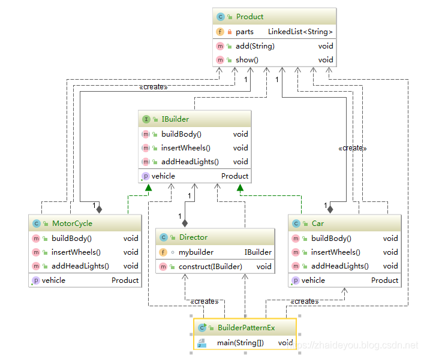
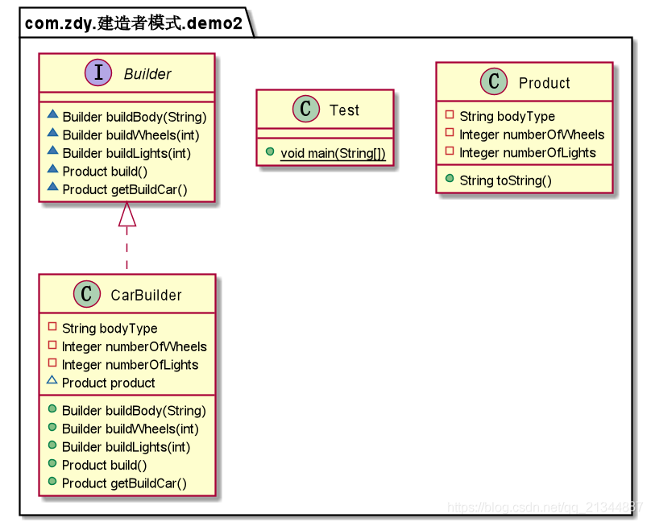

# 建造者模式

##  建造者模式（Builder Pattern）

​		是将一个复杂对象的构建与它的表示分离，使得同样的构建过程可以创建不同的表示。建造者模式属于创建型模式，对使用者而言，只需要指定需要建造的类型就可以获得对象，建造过程和细节不需要了解。

## 适用场景：

​		建造者模式适用于一个具有较多属性的复杂产品创建过程，而且产品的各个属性还需要支持动态变化，但属性的种类却总体稳定的场景。所以建造者和工厂模式的区别也很明显，工厂模式是返回一个完整的产品，不支持自由组合属性，而建造者更加灵活，完全可以由使用者自由搭配从而使同一个建造者可以建造出不同的产品。

## 优点

1. 封装性好，创建和使用分离。
2. 扩展性好，各个建造类之间相互独立，实现了解耦。

## 缺点

1. 创建产品过程中会产生多余的 Builder 对象。
2. 产品内部发生变化时，建造者都需要修改，成本较大，所以建造者模式的前提需要产品总体稳定，细节自由搭配的场景。

**指挥者Director**： 负责指挥构建,统一组建过程。工程如何构建由他决定。

**抽象建造者Buider**：规范产品的组建，一般是由子类实现具体的组建过程

**具体建造者FactBuilder**：实现特定产品的组建。

**产品Product**：需要在创建的产品。

## 1. 具有指挥者的Demo

UML



### 抽象构建者

```java
public interface IBuilder {
    void buildBody();
    void insertWheels();
    void addHeadLights();
    Product getVehicle();
}
```

### 产品
```java
public class Product {
    private LinkedList<String> parts ;

    public Product() {
        parts = new LinkedList<>();
    }

    public void add(String part){
        parts.addLast(part);
    }
    public void show(){
        System.out.println("\nProduct complete as below:");
        for (int i = 0; i < parts.size(); i++) {
            System.out.println(parts.get(i));
        }
    }
}
```
### 具体建造者

```java
public class Car implements IBuilder {
    private Product product = new Product();
    @Override
    public void buildBody() {
        product.add("this is a body of a car ");
    }

    @Override
    public void insertWheels() {
        product.add("4 wheels are added");
    }

    @Override
    public void addHeadLights() {
        product.add("2 Headlight are added");
    }

    @Override
    public Product getVehicle() {
        return product;
    }
}

```

```java
public class MotorCycle implements IBuilder {
    private Product product = new Product();
    @Override
    public void buildBody() {
        product.add("this is a body of a MotorCycle ");
    }

    @Override
    public void insertWheels() {
        product.add("2 wheels are added");
    }

    @Override
    public void addHeadLights() {
        product.add("1 Headlight are added");
    }

    @Override
    public Product getVehicle() {
        return product;
    }
}
```

### 指挥者

```java
public class Director {
    IBuilder mybuilder;
    public void construct(IBuilder builder){
        mybuilder = builder;
        mybuilder.buildBody();
        mybuilder.insertWheels();
        mybuilder.addHeadLights();
    }

}
```

测试代码

```java
public class BuilderPatternEx {
    public static void main(String[] args) {
        System.out.println("***Builder Pattern Demo***");
        //创建组装者
        Director director = new Director();
        //创建car 对象
        IBuilder carBuilder = new Car();
        //组装car
        director.construct(carBuilder);
        Product p1 = carBuilder.getVehicle();

        p1.show();
    }

}
```


## 2. 没有指挥者的建造者模式

UML



###  Buider 接口

```java
//抽象建造者
public interface Builder {

    //定制车体
    Builder buildBody(String bodyType);
    //定制车轮
    Builder buildWheels(int numberOfWheels);
    //定制车灯
    Builder buildLights(int numberOfLights);
    //生产产品
    Product build();
    //获取产品
    Product getBuildCar();
}
```
### Builder 接口实现类

```java
public class CarBuilder implements Builder{
    private String bodyType = "金属"; //默认外壳
    private Integer numberOfWheels = 4;//默认轮子
    private Integer numberOfLights = 2; //默认车灯

    //产品
    Product product;

    @Override
    public Builder buildBody(String bodyType) {
        this.bodyType = bodyType;
        return this;
    }

    @Override
    public Builder buildWheels(int numberOfWheels) {
        this.numberOfWheels = numberOfWheels;
        return this;
    }

    @Override
    public Builder buildLights(int numberOfLights) {
        this.numberOfLights = numberOfLights;
        return this;
    }

    @Override
    public Product build() {
        product = new Product(this.bodyType,this.numberOfWheels,this.numberOfLights);
        return product;
    }

    @Override
    public Product getBuildCar() {
        return product;
    }
}
```
###  产品类

```java
public class Product {

    private String bodyType;
    private Integer numberOfWheels;
    private Integer numberOfLights;

    public Product(String bodyType, Integer numberOfWheels, Integer numberOfLights) {
        this.bodyType = bodyType;
        this.numberOfWheels = numberOfWheels;
        this.numberOfLights = numberOfLights;
    }
    //此种方式不在需要set get 方法。
    @Override
    public String toString() {
        return "Product{" +
                "bodyType='" + bodyType + '\'' +
                ", numberOfWheels=" + numberOfWheels +
                ", numberOfLights=" + numberOfLights +
                '}';
    }
}
```
###  测试类

```java
public class Test {
    public static void main(String[] args) {
        //创建一个建造者
        Builder carBuilder1 = new CarBuilder();

        //1.生产默认产品
        Product product1 = carBuilder1.build();
        System.out.println(product1.toString());

        //特定需要的车
        Builder builder2 = new CarBuilder();
        Product product2 = builder2
                .buildBody("塑料")
                .buildWheels(6)
                .buildLights(4)  //去掉则使用默认值。
                .build(); // 此时才创建新的Product 对象。
        System.out.println(product2.toString());

        //3.查看已经创建好的车
        Product product3 = builder2.getBuildCar();
        System.out.println(product2.equals(product3));
        //4. 要创建和产品2一样的车型，只需要再次使用build 方法直接创建就可
        Product product4 = builder2.build();
        //4. 创建了新的对象，也就是创建了同型号的不同的两辆车
        System.out.println(product4.toString());
        System.out.println(product4.equals(product2));
    }
}
```

