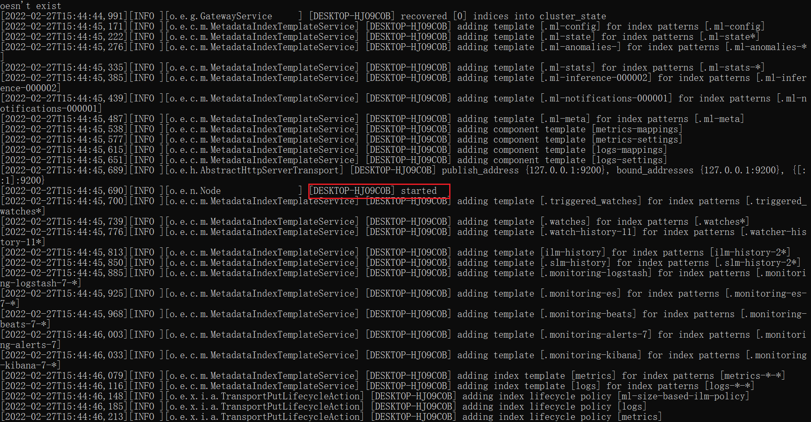
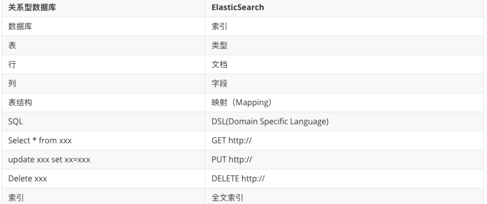

# ElasticSearch

## 1. Lucene

Lucene 是一个开源、免费、高性能、纯 Java 编写的全文检索引擎，可以算作是开源领域最好的全文检索工具包。

在实际开发中，Lucene 几乎适用于任何需要全文检索的场景，所以 Lucene 先后发展出好多语言版本，例如 C++、C#、Python 等。

早在 2005 年，Lucene 就升级为 Apache 顶级开源项目。它的作者是 Doug Cutting，有的人可能没听过这这个人，不过你肯定听过他的另一个大名鼎鼎的作品 Hadoop。

不过需要注意的是，Lucene 只是一个工具包，并非一个完整的搜索引擎，开发者可以基于 Lucene 来开发完整的搜索引擎。比较著名的有 Solr、ElasticSearch，不过在分布式和大数据环境下，ElasticSearch 更胜一筹。

Lucene 主要有如下特点：

- 简单
- 跨语言
- 强大的搜索引擎
- 索引速度快
- 索引文件兼容不同平台

## 2. ElasticSearch

ElasticSearch 是一个分布式、可扩展、近实时性的高性能搜索与数据分析引擎。ElasticSearch 基于 Java 编写，通过进一步封装 Lucene，将搜索的复杂性屏蔽起来，开发者只需要一套简单的 RESTful API 就可以操作全文检索。

ElasticSearch 在分布式环境下表现优异，这也是它比较受欢迎的原因之一。它支持 PB 级别的结构化或非结构化海量数据处理

整体上来说，ElasticSearch 有三大功能：

- 数据搜集
- 数据分析
- 数据存储

ElasticSearch 的主要特点：

1. 分布式文件存储。
2. 实时分析的分布式搜索引擎。
3. 高可拓展性。
4. 可插拔的插件支持。

### 2.1 单节点安装

首先打开 Es 官网，找到 Elasticsearch：

- https://www.elastic.co/cn/elasticsearch/

然后点击下载按钮，选择合适的版本直接下载即可。


将下载的文件解压，解压后的目录含义如下：

| 目录    | 含义           |
| :------ | :------------- |
| modules | 依赖模块目录   |
| lib     | 第三方依赖库   |
| logs    | 输出日志目录   |
| plugins | 插件目录       |
| bin     | 可执行文件目录 |
| config  | 配置文件目录   |
| data    | 数据存储目录   |

启动方式：

进入到 bin 目录下，直接执行 ./elasticsearch 启动即可。


看到 started 表示启动成功。



默认监听的端口是 9200，所以浏览器直接输入 localhost:9200 可以查看节点信息。


节点的名字以及集群（默认是 elasticsearch）的名字，我们都可以自定义配置。

打开 config/elasticsearch.yml 文件，可以配置集群名称以及节点名称。配置方式如下：

```
cluster.name: javaboy-es
node.name: master
```

配置完成后，保存配置文件，并重启 es。重启成功后，刷新浏览器 localhost:9200 页面，就可以看到最新信息。


Es 支持矩阵：

- https://www.elastic.co/cn/support/matrix

### 2.2 HEAD 插件安装

Elasticsearch-head 插件，可以通过可视化的方式查看集群信息。

这里介绍两种安装思路。

#### 2.2.1 浏览器插件安装

Chrome 直接在 App Store 搜索 Elasticsearch-head，点击安装即可。


公众号江南一点雨后台回复 Elasticsearch-head，可以下载离线安装包。

#### 2.2.2 下载插件安装

四个步骤

- `git clone git clone git@github.com:mobz/elasticsearch-head.git`
- `cd elasticsearch-head`
- `npm install`
- `npm run start`

启动成功，页面如下：


注意，此时看不到集群数据。原因在于这里通过跨域的方式请求集群数据的，默认情况下，集群不支持跨域，所以这里就看不到集群数据。

解决办法如下，修改 es 的 config/elasticsearch.yml 配置文件，添加如下内容，使之支持跨域：

```
http.cors.enabled: true
http.cors.allow-origin: "*"
```

配置完成后，重启 es，此时 head 上就有数据了。


### 2.3 分布式安装

假设：

- 一主二从
- master 的端口是 9200，slave 端口分别是 9201 和 9202

首先修改 master 的 config/elasticsearch.yml 配置文件：

```
node.master: true
network.host: 127.0.0.1
```

配置完成后，重启 master。

将 es 的压缩包解压两份，分别命名为 slave01 和 slave02，代表两个从机。

分别对其进行配置。

slave01/config/elasticsearch.yml：

```
# 集群名称必须保持一致
cluster.name: javaboy-es
node.name: slave01
network.host: 127.0.0.1
http.port: 9201
discovery.zen.ping.unicast.hosts: ["127.0.0.1"]
```

slave02/config/elasticsearch.yml：

```
# 集群名称必须保持一致
cluster.name: javaboy-es
node.name: slave02
network.host: 127.0.0.1
http.port: 9202
discovery.zen.ping.unicast.hosts: ["127.0.0.1"]
```

然后分别启动 slave01 和 slave02。启动后，可以在 head 插件上查看集群信息。

!

### 2.4 Kibana 安装

Kibana 是一个 Elastic 公司推出的一个针对 es 的分析以及数据可视化平台，可以搜索、查看存放在 es 中的数据。

安装步骤如下：

1. 下载 Kibana：https://www.elastic.co/cn/downloads/kibana
2. 解压
3. 配置 es 的地址信息（可选，如果 es 是默认地址以及端口，可以不用配置，具体的配置文件是 config/kibana.yml）
4. 执行 ./bin/kibana 文件启动
5. localhost:5601


Kibana 安装好之后，首次打开时，可以选择初始化 es 提供的测试数据，也可以不使用。

这里点击try our sample data 后添加数据。


## 3. ElasticSearch 核心概念

### 3.1 ElasticSearch 十大核心概念

#### 3.1.1 集群（Cluster）

一个或者多个安装了 es 节点的服务器组织在一起，就是集群，这些节点共同持有数据，共同提供搜索服务。

一个集群有一个名字，这个名字是集群的唯一标识，该名字成为 cluster name，默认的集群名称是 elasticsearch，具有相同名称的节点才会组成一个集群。

可以在 config/elasticsearch.yml 文件中配置集群名称：

```
cluster.name: javaboy-es
```

在集群中，节点的状态有三种：绿色、黄色、红色：

- 绿色：节点运行状态为健康状态。所有的主分片、副本分片都可以正常工作。
- 黄色：表示节点的运行状态为警告状态，所有的主分片目前都可以直接运行，但是至少有一个副本分片是不能正常工作的。
- 红色：表示集群无法正常工作。

#### 3.1.2 节点（Node）

集群中的一个服务器就是一个节点，节点中会存储数据，同时参与集群的索引以及搜索功能。一个节点想要加入一个集群，只需要配置一下集群名称即可。默认情况下，如果我们启动了多个节点，多个节点还能够互相发现彼此，那么它们会自动组成一个集群，这是 es 默认提供的，但是这种方式并不可靠，有可能会发生脑裂现象。所以在实际使用中，建议一定手动配置一下集群信息。

#### 3.1.3 索引（Index）

索引可以从两方面来理解：

**名词**

具有相似特征文档的集合。

**动词**

索引数据以及对数据进行索引操作。

#### 3.1.4 类型（Type）

类型是索引上的逻辑分类或者分区。在 es6 之前，一个索引中可以有多个类型，从 es7 开始，一个索引中，只能有一个类型。在 es6.x 中，依然保持了兼容，依然支持单 index 多个 type 结构，但是已经不建议这么使用。

#### 3.1.5 文档（Document）

一个可以被索引的数据单元。例如一个用户的文档、一个产品的文档等等。文档都是 JSON 格式的。

#### 3.1.6 分片（Shards）

索引都是存储在节点上的，但是受限于节点的空间大小以及数据处理能力，单个节点的处理效果可能不理想，此时我们可以对索引进行分片。当我们创建一个索引的时候，就需要指定分片的数量。每个分片本身也是一个功能完善并且独立的索引。

默认情况下，一个索引会自动创建 1 个分片，并且为每一个分片创建一个副本。

#### 3.1.7 副本（Replicas）

副本也就是备份，是对主分片的一个备份。

#### 3.1.8 Settings

集群中对索引的定义信息，例如索引的分片数、副本数等等。

#### 3.1.9 Mapping

Mapping 保存了定义索引字段的存储类型、分词方式、是否存储等信息。

#### 3.1.10 Analyzer

字段分词方式的定义。

### 3.2 ElasticSearch Vs 关系型数据库



## 4. 分词器

### 4.1 内置分词器

ElasticSearch 核心功能就是数据检索，首先通过索引将文档写入 es。查询分析则主要分为两个步骤：

1. 词条化：**分词器**将输入的文本转为一个一个的词条流。
2. 过滤：比如停用词过滤器会从词条中去除不相干的词条（的，嗯，啊，呢）；另外还有同义词过滤器、小写过滤器等。

ElasticSearch 中内置了多种分词器可以供使用。

内置分词器：


### 4.2 中文分词器

在 Es 中，使用较多的中文分词器是 elasticsearch-analysis-ik，这个是 es 的一个第三方插件，代码托管在 GitHub 上：

- https://github.com/medcl/elasticsearch-analysis-ik

#### 4.2.1 安装

两种使用方式：

**第一种：**

1. 首先打开分词器官网：https://github.com/medcl/elasticsearch-analysis-ik。
2. 在 https://github.com/medcl/elasticsearch-analysis-ik/releases 页面找到最新的正式版，下载下来。我们这里的下载链接是 https://github.com/medcl/elasticsearch-analysis-ik/releases/download/v7.9.3/elasticsearch-analysis-ik-7.9.3.zip。
3. 将下载文件解压。
4. 在 es/plugins 目录下，新建 ik 目录，并将解压后的所有文件拷贝到 ik 目录下。
5. 重启 es 服务。

**第二种：**

```
./bin/elasticsearch-plugin install https://github.com/medcl/elasticsearch-analysis-ik/releases/download/v7.9.3/elasticsearch-analysis-ik-7.9.3.zip
```

#### 4.2.2 测试

es 重启成功后，首先创建一个名为 test 的索引：


接下来，在该索引中进行分词测试：


#### 4.2.3 自定义扩展词库

##### 4.2.3.1 本地自定义

在 es/plugins/ik/config 目录下，新建 ext.dic 文件（文件名任意），在该文件中可以配置自定义的词库。


如果有多个词，换行写入新词即可。

然后在 es/plugins/ik/config/IKAnalyzer.cfg.xml 中配置扩展词典的位置：


##### 4.2.3.2 远程词库

也可以配置远程词库，远程词库支持热更新（不用重启 es 就可以生效）。

热更新只需要提供一个接口，接口返回扩展词即可。

具体使用方式如下，新建一个 Spring Boot 项目，引入 Web 依赖即可。然后在 resources/stastic 目录下新建 ext.dic 文件，写入扩展词：


接下来，在 es/plugins/ik/config/IKAnalyzer.cfg.xml 文件中配置远程扩展词接口：


配置完成后，重启 es ，即可生效。

热更新，主要是响应头的 `Last-Modified` 或者 `ETag` 字段发生变化，ik 就会自动重新加载远程扩展

