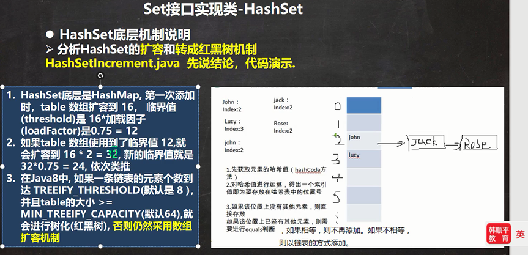
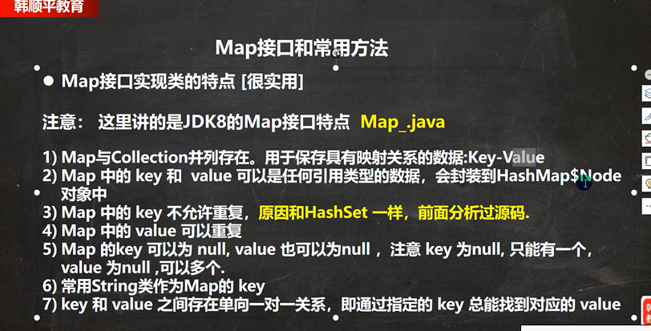
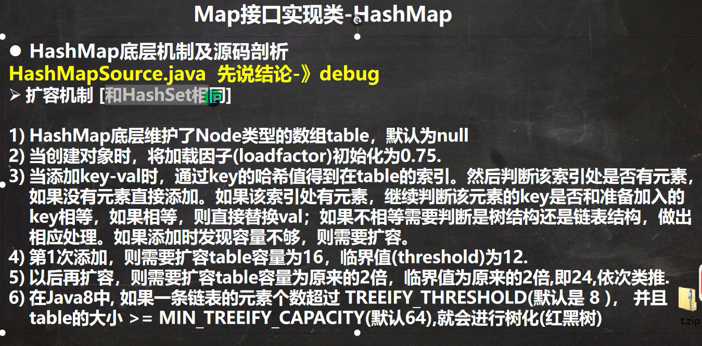
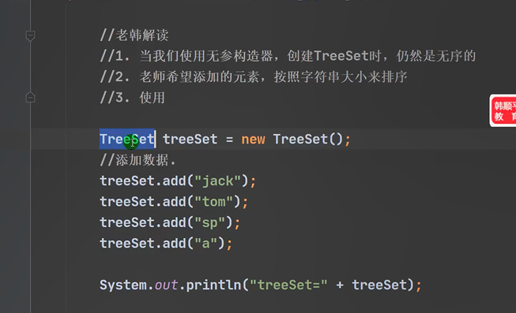

# 源码笔记

##  ArrayList

### ArrayList  源码结论：

* ArrayList 中维护了一个Object 类型的数组elementData.

	> transient Object[] elementData; //表示该属性不会被序列化

* 当创建ArrayList对象时，如果使用的是无参构造器，则初始elementData 容量为0.第一次添加，则扩容elementData 为10，如果需要再次扩容，则扩容elementData为1.5倍。

* 如果使用的是指定大小的构造器，则初始elementData 容量为指定大小，如果需要扩容，则直接扩容elementData为1.5倍。

* 容量最大为   2<sup> 31 </sup>-1

* 移除元素，数组并不缩容。

	

```java
public static void main(String[] args) {
    ArrayList list = new ArrayList(8);
    ArrayList list = new ArrayList();


    for (int i = 0; i <= 15; i++) {
        list.add(i);
    }
    list.add(100);
    list.add(200);
    list.add(null);

    for (Object o : list) {
        System.out.println(o);
    }
}
```

对上述代码进行debugger 测试，追踪源码。

```
modCount 结构上修改 列表大小的次数。
```

###  空参构造器

* 构造器源码

```java
//源码注释，显示创建一个容量大小为10的空列表，
public ArrayList() {
    this.elementData = DEFAULTCAPACITY_EMPTY_ELEMENTDATA;
}
```

但是，实际扩容是在第一次添加元素时候扩容为10.

* 追踪add()

```java
public boolean add(E e) {
    ensureCapacityInternal(size + 1);  // Increments modCount!!
    //元素添加
    elementData[size++] = e;
    return true;
}
```
* 追踪  ensureCapacityInternal（）其作用确定列表容量够用，

size 列表包含的元素数。执行add（）,意味着元素数要加1.

```java
private void ensureCapacityInternal(int minCapacity) {
    ensureExplicitCapacity(calculateCapacity(elementData, minCapacity));
}
```

此时传递的minCapacity为1，

```java
private static final int DEFAULT_CAPACITY = 10;
```

* 将minCapacity 和DEFAULT_CAPACITY 比较，返回最大值，10

```
private static int calculateCapacity(Object[] elementData, int minCapacity) {
    if (elementData == DEFAULTCAPACITY_EMPTY_ELEMENTDATA) {
        return Math.max(DEFAULT_CAPACITY, minCapacity);
    }
    return minCapacity;
}
```

* 此时minCapacity 值为10，elementData.length为0。不执行grow(),也就是扩容。

```java
private void ensureExplicitCapacity(int minCapacity) {
    //表结构改变+1
    modCount++;

    // overflow-conscious code
    if (minCapacity - elementData.length > 0)
        grow(minCapacity);
}
```

### ArrayList 扩容

* 当 minCapacity 为11时，上述过程走到

```java
if (minCapacity - elementData.length > 0)
        grow(minCapacity);
```

满足条件执行grow（）

* 追踪grow()

```java
private void grow(int minCapacity) {
    //获取之前，list 容量
    int oldCapacity = elementData.length;
    //新容量变为原来的1.5倍
    int newCapacity = oldCapacity + (oldCapacity >> 1);
    //不满足
    if (newCapacity - minCapacity < 0)
        newCapacity = minCapacity;
    //不满足
    if (newCapacity - MAX_ARRAY_SIZE > 0)
        newCapacity = hugeCapacity(minCapacity);
    //扩容关键代码
    elementData = Arrays.copyOf(elementData, newCapacity);
}
```

```java
private static final int MAX_ARRAY_SIZE = Integer.MAX_VALUE - 8;
```
* 下面代码可以看出数组容量最大值为 2<sup>31</sup>-1

```java
private static int hugeCapacity(int minCapacity) {
    if (minCapacity < 0) // overflow
        throw new OutOfMemoryError();
    return (minCapacity > MAX_ARRAY_SIZE) ?
        Integer.MAX_VALUE :
        MAX_ARRAY_SIZE;
}
```

* 之后是执行扩容的代码

Arrays.copy()  参数一，要复制的数组，参数二，新数组的容量

返回值： 一个新数组，增加的部分值为null.

```java
elementData = Arrays.copyOf(elementData, newCapacity);
```

###   有参构造器


ArrayList list = new ArrayList(8);

追踪源码

```java
public ArrayList(int initialCapacity) {
    if (initialCapacity > 0) {
        this.elementData = new Object[initialCapacity];
    } else if (initialCapacity == 0) {
        this.elementData = EMPTY_ELEMENTDATA;
    } else {
        throw new IllegalArgumentException("Illegal Capacity: "+
                                           initialCapacity);
    }
}
```

扩容机制，同样和上面一样，这里就不在详细描述。

### ArrayList remove 移除数据并不缩容。

想到添加元素扩容，那么移除元素缩容吗？

查看源码

```java
public E remove(int index) {
    rangeCheck(index);

    modCount++;
    E oldValue = elementData(index);

    int numMoved = size - index - 1;
    if (numMoved > 0)
        System.arraycopy(elementData, index+1, elementData, index,
                         numMoved);
    elementData[--size] = null; // clear to let GC do its work

    return oldValue;
}
```

```java
private void rangeCheck(int index) {
    if (index >= size)
        throw new IndexOutOfBoundsException(outOfBoundsMsg(index));
}
```


```java
@SuppressWarnings("unchecked")
E elementData(int index) {
    return (E) elementData[index];
}
```
本地方法

```java
public static native void arraycopy(Object src,  int  srcPos,
                                    Object dest, int destPos,
                                    int length);
```

代码比较简单，就不细说了，可以看出，并不缩容。


------------------------------------------------------------------------

## Vector源码

### 基本介绍

* Vector 类定义说明

	Class Vector<E>

	- [java.lang.Object](https://docs.oracle.com/en/java/javase/11/docs/api/java.base/java/lang/Object.html)
	- - [java.util.AbstractCollection](https://docs.oracle.com/en/java/javase/11/docs/api/java.base/java/util/AbstractCollection.html)<E>
		- - [java.util.AbstractList](https://docs.oracle.com/en/java/javase/11/docs/api/java.base/java/util/AbstractList.html)<E>
			- - java.util.Vector<E>

	- - **Type Parameters:**

			`E` - Type of component elements

		- All Implemented Interfaces:

			`Serializable`, `Cloneable`, `Iterable<E>`, `Collection<E>`, `List<E>`, `RandomAccess`

		- Direct Known Subclasses:

			`Stack`

* 底层是一个可变对象数组。

* 默认容量10,也可以定制容量大小。扩容机制2倍。最大容量长度2<sup>31</sup>-1

* 线程同步，即线程安全，如果开发中考虑线程安全可以使用Vector.

### 源码

### 级别标题

```java
public static void main(String[] args) {
    Vector vector = new Vector();

    for (int i = 0; i < 15;i++) {
        vector.add(i);
    }
}
```

```java
//默认容量10，
public Vector() {
    this(10);
}
```

```java
public Vector(int initialCapacity) {
    this(initialCapacity, 0);
}
```

```java
public Vector(int initialCapacity, int capacityIncrement) {
    super();
    if (initialCapacity < 0)
        throw new IllegalArgumentException("Illegal Capacity: "+
                                           initialCapacity);
    this.elementData = new Object[initialCapacity];
    this.capacityIncrement = capacityIncrement;
}
```


###   扩容源码

```java
public synchronized boolean add(E e) {
    modCount++;
    ensureCapacityHelper(elementCount + 1);
    elementData[elementCount++] = e;
    return true;
}
```


```java
private void ensureCapacityHelper(int minCapacity) {
    // overflow-conscious code
    if (minCapacity - elementData.length > 0)
        grow(minCapacity);
}
```

```java
protected int capacityIncrement;
```

```java
private void grow(int minCapacity) {
    // overflow-conscious code
    int oldCapacity = elementData.length;
    //原来容量的2倍
    int newCapacity = oldCapacity + ((capacityIncrement > 0) ?
                                     capacityIncrement : oldCapacity);
    if (newCapacity - minCapacity < 0)
        newCapacity = minCapacity;
    if (newCapacity - MAX_ARRAY_SIZE > 0)
        newCapacity = hugeCapacity(minCapacity);
    elementData = Arrays.copyOf(elementData, newCapacity);
}
```

-------------------------------------------------

##  LinkedList


### 基本介绍

* LinkedList 底层维护的是一个双向链表

* LinkedList 维护了2个属性first 和 last 分别指向首节点和尾节点

* 每个节点（Node 对象），里面又维护了prev、next、item三个属性，其中通过prev 指向前一个节点，通过next 指向后一个节点，最终实现双向链表。

* LinkedList 元素的添加和删除不是通过数组完成的，相对效率较高。

	

### 检测源码

```java
public static void main(String[] args) {
    LinkedList linkedList = new LinkedList();
    linkedList.add(1);
    linkedList.add(2);
    linkedList.add(3);
    System.out.println("linkedList=="+linkedList);
	Object o = linkedList.get(1);
    linkedList.remove();
    linkedList.remove(1);
    System.out.println("linkedList=="+linkedList);


}
```

### 添加元素

构造器

```
public LinkedList() {
}
```

```
public boolean add(E e) {
    linkLast(e);
    return true;
}
```

```java
void linkLast(E e) {
    final Node<E> l = last;
    final Node<E> newNode = new Node<>(l, e, null);
    last = newNode;
    if (l == null)
        first = newNode;
    else
        l.next = newNode;
    size++;
    modCount++;
}
```

```java
private static class Node<E> {
    E item;
    Node<E> next;
    Node<E> prev;

    Node(Node<E> prev, E element, Node<E> next) {
        this.item = element;
        this.next = next;
        this.prev = prev;
    }
}
```

### 删除元素

```java
public E remove() {
    return removeFirst();
}
```

```java
public E removeFirst() {
    final Node<E> f = first;
    if (f == null)
        throw new NoSuchElementException();
    return unlinkFirst(f);
}
```

 

```java
private E unlinkFirst(Node<E> f) {
    // assert f == first && f != null;
    final E element = f.item;
    final Node<E> next = f.next;
    f.item = null;
    f.next = null; // help GC
    first = next;
    if (next == null)
        last = null;
    else
        next.prev = null;
    size--;
    modCount++;
    return element;
}
```

### 查找元素

```java
public E get(int index) {
    checkElementIndex(index);
    return node(index).item;
}
```

```java
private void checkElementIndex(int index) {
    if (!isElementIndex(index))
        throw new IndexOutOfBoundsException(outOfBoundsMsg(index));
}
```

```java
private boolean isElementIndex(int index) {
    return index >= 0 && index < size;
}
```

```java
Node<E> node(int index) {
    // assert isElementIndex(index);
	//index 和 size /2 比较。
    if (index < (size >> 1)) {
        //index 在前半部分，从前往后查找
        Node<E> x = first;
        for (int i = 0; i < index; i++)
            x = x.next;
        return x;
    } else {
        //index 在后半部分，从后往往前查找
        Node<E> x = last;
        for (int i = size - 1; i > index; i--)
            x = x.prev;
        return x;
    }
}
```


## HashSet

###  基本介绍

* HashSet 的全面书名
* HashSet 实现了Set 接口
* HashSet 实际上是HashMap

* 可以存放null ,但是只能有一个
* 不保证元素是有序的，即存入的顺序和遍历输出的顺序一直。
* 不能有重复的对象


### 概述

HashSet 底层 是 HasHMap

* 添加一个元素是，先得到hash值，会转成索引值，

* 找到存储数据表table，Table 默认大小16,看到这个索引位置是否已经存放的有元素,

* 如果没有直接加入

* 如果使用equlas（） 方法比较是否相等，equals 需要重写。相等就放弃添加，如果不相同添加到最后。

* 一个链表的元素个数（size）到达8个，并且 table >= MIN_TREEIFY_CAPACITY(默认64)时，转为红黑树。

* 移除元素时，链表元素少于6时转回链表。

	

### 源码解读

#### 分析构造器

* 创建HasHSet 底层是HashMap

```java
public HashSet() {
    map = new HashMap<>();
}
```

```java
private transient HashMap<E,Object> map;
```


* HashSet 添加元素
* 添加元素，实际调用了HashMap的put（），put 方法的 key 即为添加元素。value 为HasHMap 类属性

PRESENT=new Object();

```java
public boolean add(E e) {
    return map.put(e, PRESENT)==null;
}
```

```java
private static final Object PRESENT = new Object();
```

* 追踪HashMap() 的 put 方法，其调用了 HashMap 的 putVal()


```JAVA
public V put(K key, V value) {
    return putVal(hash(key), key, value, false, true);
}
```
#### 分析添加元素的hash值，hash(key)

```JAVA
static final int hash(Object key) {
    int h;
    //如果添加元素为null ,返回hash值0，否则返回  添加元素key的hashcode()求得的h,并与 h值右移16后，做异或运算。
    return (key == null) ? 0 : (h = key.hashCode()) ^ (h >>> 16);
}
```

Object 类的本地方法hashCode()

```
public native int hashCode();
```

具体实现由Key 的 类型来实现。如这里key 是String 类型，String 类中的 hashCode 代码如下。

```java
public int hashCode() {
    int h = hash;
    if (h == 0 && value.length > 0) {
        char val[] = value;

        for (int i = 0; i < value.length; i++) {
            h = 31 * h + val[i];
        }
        hash = h;
    }
    return h;
}
```

Integer 类重写的hashCode() 方法

```java
@Override
public int hashCode() {
    return Integer.hashCode(value);
}
```

```java
public static int hashCode(int value) {
    return value;
}
```

#### 分析HashMap 重点方法putVal()


* 如果第一次添加元素，判断table是null 或者 table 的容量0 时。
* tab = resize() 为 table 扩容。`resize()`具体扩容代码后面分析。

```
if ((tab = table) == null || (n = tab.length) == 0)
    n = (tab = resize()).length;
```

* tab[i = (n - 1) & hash。 其中 hash 是跟随参数传入的要添加元素的计算出的hash 值。(n-1) & hash 计算出 要添加元素位于table 中的位置。tab[i = (n - 1) & hash 表示table 要添加位置的内容。p = tab[i = (n - 1) & hash]   表示 table 要添加位置的内容，赋值给p.
* 如果p ==null ,就在 p 的位置添加元素节点。`tab[i] = newNode(hash, key, value, null)`

```java
 if ((p = tab[i = (n - 1) & hash]) == null)
        tab[i] = newNode(hash, key, value, null);
```

* 每次添加完元素，modCount 会+1。记录修改次数
* 判断table 大小超过 threshold 进行扩容
* hashMap 留给子类去实现的。对于HashMap 来说是一个空方法。
* 返回null ，代表添加元素成功。

```java
++modCount;
if (++size > threshold)
    resize();
afterNodeInsertion(evict);
return null;
```

* `p.hash == hash &&((k = p.key) == key || (key != null && key.equals(k))`

这种情况是要添加元素的对应的table 表的要添加的位置p已经有元素了。

* 比较要添加元素的Node节点的hash 值和已经存在元素的 hash 值是否相等。

* 如果相等满足以下二个条件中的一个即可，

	* 比较当前位置元素的与添加Node 节点的key 是否相等，如果相等满足
	* 比较key不等于null ，且 添加 Node元素key 和 p  equals() 比较也相等。

	说明添加的元素已经在HashSet 中存在，使用e 记录一下p 即可

```java
if (p.hash == hash &&
    ((k = p.key) == key || (key != null && key.equals(k))))
    e = p;
```

* 如果上述条件不满足，判断已经存在的元素节点p 是不是红黑树，如果是使用红黑树添加，并使用e 记录添加结果

```java
else if (p instanceof TreeNode)
    e = ((TreeNode<K,V>)p).putTreeVal(this, tab, hash, key, value);
```

* 如果p 不是 红黑树，就使用链表的方式添加。

```java
 else {//table 对应索引位置，已经是一个链表，就是使用for 循环比较。
            //如果和链表中每个元素都不相同，就添加到元素最后。	
            //如果有相同的情况，就直接break
            for (int binCount = 0; ; ++binCount) {//死循环
                if ((e = p.next) == null) {
                    p.next = newNode(hash, key, value, null);
                    //添加元素后，立即判断是否达到8 个节点，如果满足就进行树化
                    //在转成红黑树时，还进行一个判断，tab 小于64 时，还不会进行树化，
                    //先进行表扩容。 static final int TREEIFY_THRESHOLD = 8;
                    if (binCount >= TREEIFY_THRESHOLD - 1) //binCount 等于 7
                        //进行树化,进行树化后面再分析其代码
                        treeifyBin(tab, hash);
                    break; //退出条件
                }
                //从链表中一个一个比较元素是否相等
                if (e.hash == hash &&
                    ((k = e.key) == key || (key != null && key.equals(k))))
                    break; // 有相同元素，退出循环,这时候e = 添加添加元素节点。
                //如果不相等 p 指向下一节点
                p = e;
            }
```

* 采用以上三种情况添加后
* 在HashSet 中 onlyIfAbsent 为false ,所以走 if 语句。
* 所以当e 不等于null 时，即，没有添加元素。替换value。

```java
if (e != null) { // existing mapping for key
    V oldValue = e.value;
    if (!onlyIfAbsent || oldValue == null)
        e.value = value;  //替换值，key 值相同，替换值。
    afterNodeAccess(e);
    return oldValue;
}
```


1. HashMap 静态内部Node

```java
static class Node<K,V> implements Map.Entry<K,V> {
    final int hash;
    final K key;
    V value;
    Node<K,V> next;

    Node(int hash, K key, V value, Node<K,V> next) {
        this.hash = hash;
        this.key = key;
        this.value = value;
        this.next = next;
    }

    public final K getKey()        { return key; }
    public final V getValue()      { return value; }
    public final String toString() { return key + "=" + value; }

    public final int hashCode() {
        return Objects.hashCode(key) ^ Objects.hashCode(value);
    }

    public final V setValue(V newValue) {
        V oldValue = value;
        value = newValue;
        return oldValue;
    }

    public final boolean equals(Object o) {
        if (o == this)
            return true;
        if (o instanceof Map.Entry) {
            Map.Entry<?,?> e = (Map.Entry<?,?>)o;
            if (Objects.equals(key, e.getKey()) &&
                Objects.equals(value, e.getValue()))
                return true;
        }
        return false;
    }
}
```

2. HashMap 相关属性

```java
//1、HashMap 的 table 属性，是一个Node 节点数组
transient Node<K,V>[] table;
//2、记录结构修改次数，初始值为0
transient int modCount;
//3、HashMap 存储元素的 个数
 transient int size;
//4、 初始扩容 16
 static final int DEFAULT_INITIAL_CAPACITY = 1 << 4; 
//5、加载因子
 static final float DEFAULT_LOAD_FACTOR = 0.75f;
//6、table 扩容界限值  threshold = capacity * load factor
int threshold;
```

3. HashMap 相关方法

```java
//2、hashMap 的方法newNode
 Node<K,V> newNode(int hash, K key, V value, Node<K,V> next) {
        return new Node<>(hash, key, value, next);
    }
```
#### putVal() 完整代码分析

```java
final V putVal(int hash, K key, V value, boolean onlyIfAbsent,
               boolean evict) {
    //定义辅助变量
    //tab 表示table 表
    //p 要添加元素的Node 节点，其key 值即为
    Node<K,V>[] tab; Node<K,V> p; int n, i;
    //1. 如果tab 为null，第一次添加元素，进行扩容 16个空间。
    if ((tab = table) == null || (n = tab.length) == 0)
        n = (tab = resize()).length;
    //2.根据key 计算的hash 值，得到该key 应该存放的hash 表的位置。并把这个位置的对象赋值给p.
    //(2)判断p 是否为null.
    //如果为null ,表示还没有存放过数据，就创建一个newNode(hash, key, value, null); ，放在该位置
    if ((p = tab[i = (n - 1) & hash]) == null)
        tab[i] = newNode(hash, key, value, null);
    //如果不为null,
    else {
        //定义辅助变量e 
        Node<K,V> e; K k;
        if (p.hash == hash && //1.当前插入位置的hash 值 ，和要插入的key 的hash值做比较
            //2. 并且准备Node 节点的key == 当前位置p Node 节点的key 是同一对象。 
            //3. 插入元素Node的key 不为空，且和当前位置 p Node 节点key equals() 方法比较后相同。	
            ((k = p.key) == key || (key != null && key.equals(k))))
            //添加元素为p存在Node 的key
            e = p;
        //判断P 是不是 红黑树，如果是就按照红黑树的方式putTreeVal（）
        else if (p instanceof TreeNode)
            //执行 红黑树的添加方法
            e = ((TreeNode<K,V>)p).putTreeVal(this, tab, hash, key, value);
        else {//table 对应索引位置，已经是一个链表，就是使用for 循环比较。
            //如果和链表中每个元素都不相同，就添加到元素最后。	
            //如果有相同的情况，就直接break
            for (int binCount = 0; ; ++binCount) {//死循环
                if ((e = p.next) == null) {
                    p.next = newNode(hash, key, value, null);
                    //添加元素后，立即判断是否达到8 个节点，如果满足就进行树化
                    //在转成红黑树时，还进行一个判断，tab 小于64 时，还不会进行树化，
                    //先进行表扩容。
                    if (binCount >= TREEIFY_THRESHOLD - 1) // -1 for 1st
                        
                        treeifyBin(tab, hash);
                    break; //退出条件
                }
                //如果相等，就跳出循环
                if (e.hash == hash &&
                    ((k = e.key) == key || (key != null && key.equals(k))))
                    break; // 有相同元素，退出循环
                //指向下一节点
                p = e;
            }
        }
        //若果e 不为Null  就表示添加不成功，返回 Node 节点的 value 值。
        if (e != null) { // existing mapping for key
            V oldValue = e.value;
            if (!onlyIfAbsent || oldValue == null)
                e.value = value;
            afterNodeAccess(e);
            return oldValue;
        }
    }
    //执行一次操作
    ++modCount;
    //判断存储元素是否大于 容量的 0.75。 
    if (++size > threshold)
        //扩容
        resize();
    //hashMap 留给子类去实现的。对于HashMap 来说是一个空方法。
    afterNodeInsertion(evict);
    return null;
}
```


### HashSet    resize() 扩容机制

结论：

1. HashSet 底层是HashMap,第一次添加是，table 数组扩容到16，加载因子0.75.
1. 如果table 数组使用到了临界值12，就会扩容2倍。新的临界值就是 32 * 0.75 = 24 。依次类推
1. 在Java 8 中，如果一个链表的元素个数到达 TREEIFY_THRESHOLD(8),并且 table 大小 >= MIN_TREEIFY_CAPACITY(默认64)，就会进行转为红黑树，否则任然采用数组扩容鸡机制。



```java
final Node<K,V>[] resize() {
    //
    Node<K,V>[] oldTab = table;
    //计算table容量，null 就是0. 
    int oldCap = (oldTab == null) ? 0 : oldTab.length;
    //table 临界值
    int oldThr = threshold;
    int newCap, newThr = 0;
    //如果 table 容量大于0 
    if (oldCap > 0) {
       // 如果table 容量大于 static final int MAXIMUM_CAPACITY = 1 << 30;
        if (oldCap >= MAXIMUM_CAPACITY) {
            //临界值为 2<sup>31</sup> -1
            threshold = Integer.MAX_VALUE;
            return oldTab;
        }
        //新的容量等于旧的容量的2倍 且小于 最大容量
        else if ((newCap = oldCap << 1) < MAXIMUM_CAPACITY &&
                 //旧的容量大于默认初始化容量16
                 oldCap >= DEFAULT_INITIAL_CAPACITY)
            //临界值也扩大二倍
            newThr = oldThr << 1; // double threshold
    }
    else if (oldThr > 0) //初始化是被替换
        newCap = oldThr;
    else {               // 
        newCap = DEFAULT_INITIAL_CAPACITY; // 默认 16
        newThr = (int)(DEFAULT_LOAD_FACTOR * DEFAULT_INITIAL_CAPACITY);// 默认12
    }
    if (newThr == 0) {
        //计算临界值
        float ft = (float)newCap * loadFactor;
        newThr = (newCap < MAXIMUM_CAPACITY && ft < (float)MAXIMUM_CAPACITY ?
                  (int)ft : Integer.MAX_VALUE);
    }
    threshold = newThr;
    @SuppressWarnings({"rawtypes","unchecked"})
    Node<K,V>[] newTab = (Node<K,V>[])new Node[newCap];
    table = newTab;
    if (oldTab != null) {
        for (int j = 0; j < oldCap; ++j) {
            Node<K,V> e;
            if ((e = oldTab[j]) != null) {
                oldTab[j] = null;
                if (e.next == null)
                    newTab[e.hash & (newCap - 1)] = e;
                else if (e instanceof TreeNode)
                    ((TreeNode<K,V>)e).split(this, newTab, j, oldCap);
                else { // preserve order
                    Node<K,V> loHead = null, loTail = null;
                    Node<K,V> hiHead = null, hiTail = null;
                    Node<K,V> next;
                    do {
                        next = e.next;
                        if ((e.hash & oldCap) == 0) {
                            if (loTail == null)
                                loHead = e;
                            else
                                loTail.next = e;
                            loTail = e;
                        }
                        else {
                            if (hiTail == null)
                                hiHead = e;
                            else
                                hiTail.next = e;
                            hiTail = e;
                        }
                    } while ((e = next) != null);
                    if (loTail != null) {
                        loTail.next = null;
                        newTab[j] = loHead;
                    }
                    if (hiTail != null) {
                        hiTail.next = null;
                        newTab[j + oldCap] = hiHead;
                    }
                }
            }
        }
    }
    return newTab;
}
```

### HashSet 树化

```java
final void treeifyBin(Node<K,V>[] tab, int hash) {
    int n, index; Node<K,V> e;
    //表名，即使链表长度到达8，如果 table 容量不大于 64 ，依然扩容，不进行树化
    if (tab == null || (n = tab.length) < MIN_TREEIFY_CAPACITY)
        resize();
    else if ((e = tab[index = (n - 1) & hash]) != null) {
        TreeNode<K,V> hd = null, tl = null;
        do {
            //将Node 节点转化为Tree 节点
            TreeNode<K,V> p = replacementTreeNode(e, null);
            if (tl == null)
                hd = p;
            else {
                p.prev = tl;
                tl.next = p;
            }
            tl = p;
        } while ((e = e.next) != null);
        if ((tab[index] = hd) != null)
            hd.treeify(tab);
    }
}
```

```java
TreeNode<K,V> replacementTreeNode(Node<K,V> p, Node<K,V> next) {
    return new TreeNode<>(p.hash, p.key, p.value, next);
}
```

## LinkedHashSet

### 基本介绍


## HashMap

### 基本介绍





### HashMap 扩容机制

测试代码


## HashTable

### 基本介绍

* HashTable 继承Dictionary 类
* k和v 都不能为空，否则会抛出空指针异常。
* HashTable 是线程安全的。


底层介绍

* HashTable 底层数组，HashTable$Entry 初始大小11. 加载因子0.75
* 扩容机制。满足 rehash() 进行扩容，扩容2倍+1。

## TreeSet

基本介绍

可以对set 集合进行排序

底层是TreeMap



## TreeMap

### 基本介绍

* 构造方法添加比较器，可以实现有序排序。

* 存储结构为树。
